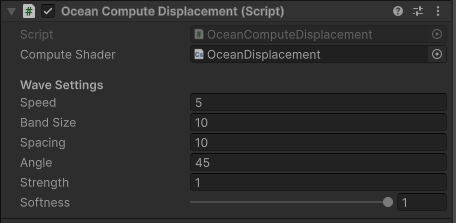
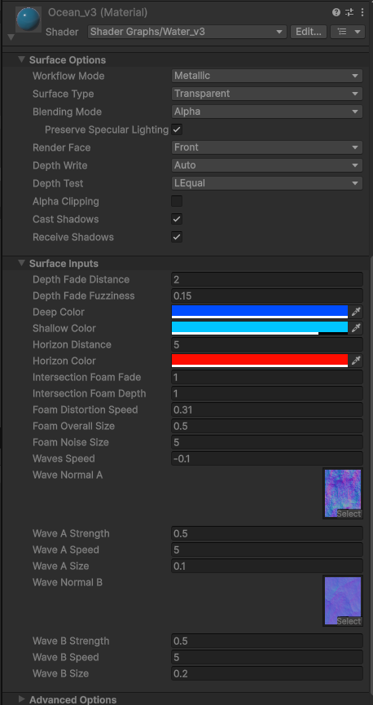

# Stylized Water Shader

This shader combines a few well-known techniques to create a stylized water surface, focusing on visual control and gameplay integration (such as floating objects).

---

## Techniques Used

### 1. Absolute World Position
This method uses absolute world position to project:
- base water texture  
- normal map  
- foam  

This avoids the common issue of textures sticking to objects and ensures seamless continuity across the world.

---

### 2. Compute Shader Vertex Displacement
A compute shader is used to deform the water mesh vertices in real time.

- Based on simple sine and cosine functions  
- No Gerstner waves or complex simulations  
- Runs on the GPU, making it scalable for larger meshes  

The key advantage here is:
The same wave logic is reused on the CPU

This allows querying the wave height at any world position, enabling buoyancy systems and interaction with other objects.

---

### 3. Wave Sampling (Water Height)
The wave height can be queried via code using the same formula as the shader.

This enables:
- objects to float correctly  
- perfect sync between visuals and gameplay  
- avoidance of artifacts like objects clipping through waves  

---

## Scripts

### 1. OceanComputeDisplacement.cs  
Responsible for:
- controlling wave parameters (speed, direction, strength, etc.)  
- dispatching the compute shader  
- deforming the water mesh in real time  
- providing the `GetWaveHeight()` function for other systems  

This acts as the core controller of the ocean system.

---

### 2. OceanDisplacement.compute  
Compute shader running on the GPU.

Responsible for:
- applying vertex displacement  
- calculating wave shapes  
- using parameters passed from the main script  

This is where the visual deformation happens.

---

### 3. RaftBuoyancyEffect.cs  
Handles more complex floating objects (such as boats).

Responsible for:
- sampling multiple points on the water surface  
- computing the average height  
- calculating object tilt based on wave normals  

This allows objects to naturally align with the wave surface instead of only moving vertically.

---

### 4. BuoyancyProbe.cs  
Simplified buoyancy component.

Responsible for:
- sampling water height at a single point  
- updating object position on the Y axis  

Useful for simple objects or testing.

---

### 5. Shader and Material

---

## Notes

- This system does not use real physics, it is a visual approximation  
- Much cheaper than real fluid simulation  
- Highly controllable for stylized visuals  
- Suitable for games similar to Zelda: Wind Waker style water  

---

Overall, the system separates responsibilities effectively:
- GPU handles visual deformation  
- CPU replicates the logic for gameplay interaction  

This keeps everything consistent, performant, and predictable.

## Configurations
